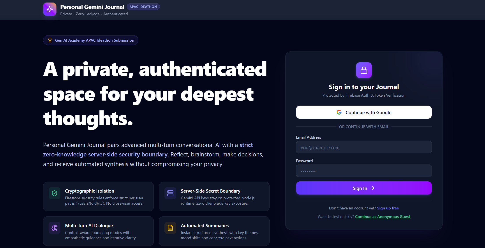
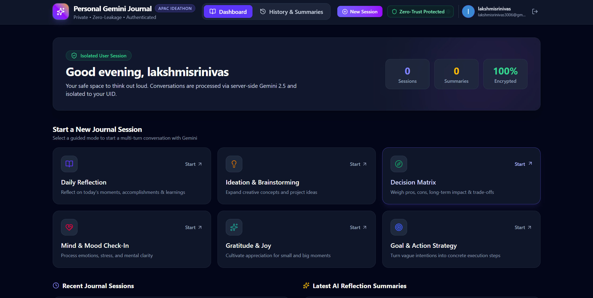
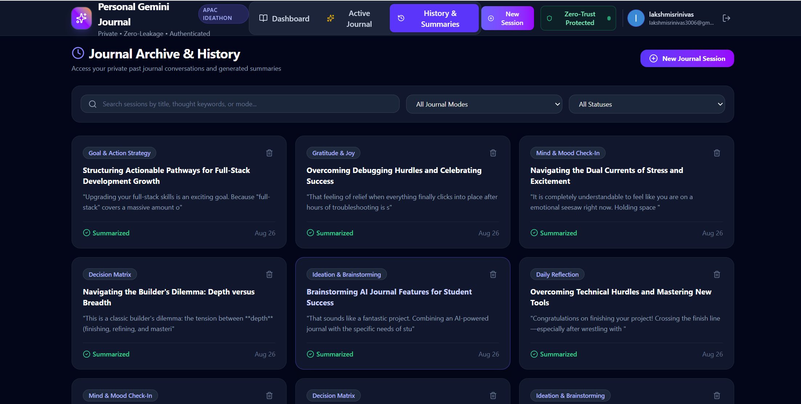

<div align="center">

# ✦ Personal Gemini Journal ✦

### 🧠 A Private, AI-Powered Space for Reflection, Clarity & Personal Growth

**Turn everyday thoughts into meaningful conversations, structured insights, and a continuous personal AI journey.**

<br/>

[](https://lakshmi0005.github.io/personal-gemini-journal/)
[](https://ai.studio/apps/da385fe2-87d6-412c-9c85-2c503b2433dd)
[](https://github.com/Lakshmi0005/personal-gemini-journal)

<br/>


<br/>

### 🏆 Gen AI Academy — APAC Ideathon Submission

**Google Gemini • Firebase • React • TypeScript • Node.js**

<br/>

> ### *"Don't just write your thoughts. Understand them."*

</div>

---

# 📑 Table of Contents

- [🌟 About the Project](#-about-the-project)
- [💡 The Idea](#-the-idea)
- [🎯 Problem Statement](#-problem-statement)
- [💭 Our Solution](#-our-solution)
- [✨ What Makes It Different](#-what-makes-it-different)
- [🖥️ Application Preview](#️-application-preview)
- [🚀 Core Features](#-core-features)
- [🧠 Intelligent Journaling Modes](#-intelligent-journaling-modes)
- [🔄 User Journey](#-user-journey)
- [🏗️ System Architecture](#️-system-architecture)
- [🤖 Gemini AI Workflow](#-gemini-ai-workflow)
- [🔐 Authentication & Security](#-authentication--security)
- [🛡️ Security Architecture](#️-security-architecture)
- [📝 AI Session Summaries](#-ai-session-summaries)
- [🧭 Personal AI Journey](#-personal-ai-journey)
- [🗂️ Session History](#️-session-history)
- [🛠️ Technology Stack](#️-technology-stack)
- [📁 Project Structure](#-project-structure)
- [🔌 API Architecture](#-api-architecture)
- [⚙️ Local Setup](#️-local-setup)
- [🔑 Environment Configuration](#-environment-configuration)
- [🏗️ Build & Deployment](#️-build--deployment)
- [🌐 GitHub Pages](#-github-pages)
- [⚠️ Deployment Architecture Note](#️-deployment-architecture-note)
- [🧪 Development Commands](#-development-commands)
- [🔒 Privacy & Design Principles](#-privacy--design-principles)
- [📈 Future Scope](#-future-scope)
- [🏆 Ideathon Context](#-ideathon-context)
- [👩‍💻 Author](#-author)
- [⭐ Support](#-support)

---

# 🌟 About the Project

**Personal Gemini Journal** is an AI-powered journaling and self-reflection platform that transforms traditional journaling into an interactive conversation.

Instead of simply storing paragraphs written by a user, the application allows the user to **talk through thoughts with AI**, explore ideas, examine decisions, reflect on experiences, and convert conversations into structured insights.

At the center of the application is **Google Gemini**, which enables context-aware, multi-turn conversations and intelligent synthesis of journal sessions.

The platform combines:

- 🤖 Conversational AI
- 📓 Personal journaling
- 🔐 User authentication
- 📝 Automatic session summarization
- 🧠 Context-aware conversations
- 📚 Journal history
- 🧭 Long-term personal journey synthesis
- 🛡️ Server-side security boundaries
- ☁️ Firebase services
- 🌐 Modern responsive web development

The goal is simple:

> **Make journaling more interactive, reflective, structured, and meaningful.**

---

# 💡 The Idea

Traditional journals are excellent places to record thoughts.

But they usually stop there.

A person might write hundreds of journal entries over months or years, yet still have difficulty answering questions such as:

- What topics do I repeatedly think about?
- What decisions have I been struggling with?
- What goals have I mentioned but not acted upon?
- How has my thinking changed?
- What themes keep appearing?
- What did I learn from previous reflections?
- What should I revisit?
- What patterns exist across my journal sessions?

This project explores a different possibility:

> **What if a journal could help you understand what you write?**

Personal Gemini Journal combines journaling with generative AI so that reflection becomes a **conversation rather than a one-way activity**.

---

# 🎯 Problem Statement

Personal reflection is valuable, but traditional digital journaling has several limitations.

### 1. Journaling is mostly passive

Most journal applications allow users to write and store text but provide little assistance in exploring those thoughts further.

### 2. Important insights become buried

As the number of journal entries grows, meaningful themes and previous decisions become difficult to rediscover.

### 3. Reflection can lack structure

Users may know that something is bothering them but may not know which questions to ask themselves.

### 4. Different situations require different thinking styles

Brainstorming an idea is fundamentally different from processing an emotion or evaluating a major decision.

### 5. AI integration introduces privacy concerns

Personal journals may contain highly private information. An AI-powered journal therefore needs a thoughtful authentication and server-side architecture.

---

# 💭 Our Solution

Personal Gemini Journal addresses these challenges by combining **AI conversation, structured reflection, session history, automatic summarization, authentication, and journey-level analysis**.

Instead of:

```text
Write → Save → Forget
```

the experience becomes:

```text
Think
  ↓
Write
  ↓
Discuss with Gemini
  ↓
Explore the thought
  ↓
Discover patterns
  ↓
Generate structured summary
  ↓
Save session
  ↓
Revisit history
  ↓
Synthesize multiple sessions
  ↓
Understand your Personal AI Journey
```

The result is a journal designed not only to **capture thoughts**, but also to help users **make sense of them**.

---

# ✨ What Makes It Different

| Traditional Digital Journal | Personal Gemini Journal |
|---|---|
| Static text entries | Multi-turn AI conversations |
| One journaling style | Multiple reflection modes |
| User structures everything manually | AI assists reflection |
| Entries accumulate independently | Sessions can contribute to a broader journey |
| Manual review | Structured AI summaries |
| Difficult to spot patterns | Journey-level synthesis |
| Basic storage experience | Interactive reflective experience |
| Usually no AI reasoning layer | Gemini-powered conversational layer |
| Generic text input | Context-aware reflection modes |
| Entries are the final output | Entries become inputs for deeper understanding |

---

# 🖥️ Application Preview

## 🔐 Private & Authenticated Entry

The landing experience introduces the journal while providing a dedicated authentication interface.

Users can access the application through supported Firebase Authentication methods while the rest of the application remains associated with the authenticated user context.

<div align="center">



**Secure entry point to the Personal Gemini Journal**

</div>

---

## 📊 Personal Journal Dashboard

After entering the application, users are presented with a centralized dashboard designed to make journal sessions, recent activity, and AI-powered insights easy to access.

<div align="center">



**A centralized view of the user's personal reflection journey**

</div>

---

## 🗂️ Journal History

Previous journal sessions remain accessible through the history interface, allowing users to return to earlier reflections instead of losing them in an endless stream of entries.

<div align="center">



**Review and revisit previous reflection sessions**

</div>

---

# 🚀 Core Features

## 🤖 1. Gemini-Powered Conversational Journaling

The core experience is a conversational journal powered by **Google Gemini**.

Instead of producing a single response to a journal entry, the application supports a **multi-turn conversation**.

This enables users to progressively explore a thought.

For example:

```text
USER
I've been working hard lately, but I still feel like
I'm not making enough progress.

        ↓

GEMINI
What makes you feel that your progress isn't enough?

        ↓

USER
I keep comparing what I've done with people who
seem much further ahead.

        ↓

GEMINI
If you removed that comparison for a moment, what
evidence would you use to measure your own progress?
```

The value is not simply in generating an answer.

The AI acts as a **reflection partner**, helping the user continue thinking.

---

## 💬 2. Multi-Turn Context

Journal conversations are not isolated prompts.

The application can send relevant conversation history as part of the request so Gemini can respond with awareness of the ongoing discussion.

Conceptually:

```text
Message 1 ─┐
Message 2 ─┤
Message 3 ─┼──► Conversation Context ───► Gemini
Message 4 ─┤
Current ───┘
```

This allows later responses to build naturally on earlier messages.

---

## 🔐 3. Firebase Authentication

The application uses **Firebase Authentication** to establish user identity.

The interface supports authentication flows including:

- Google sign-in
- Email/password authentication
- Guest/anonymous access where configured

After authentication, Firebase can provide an ID token representing the current user.

That token is attached to protected backend requests.

```text
User
  │
  ▼
Firebase Authentication
  │
  ▼
Firebase ID Token
  │
  ▼
Authorization: Bearer <token>
  │
  ▼
Protected Server Endpoint
```

---

## 📝 4. Automatic AI Summaries

Long conversations can become difficult to revisit.

Personal Gemini Journal therefore includes an AI-powered summarization workflow.

A completed session can be transformed into a more structured reflection containing information such as:

- Session title
- High-level overview
- Important themes
- Action items
- Emotional/mood observations
- Questions worth revisiting

This transforms:

```text
Long conversation
      ↓
Gemini synthesis
      ↓
Structured journal summary
```

The user does not need to manually reread every message to remember the key ideas from the session.

---

## 🗂️ 5. Journal History

Previous sessions can be revisited through the history experience.

History turns journaling into an accumulating personal record rather than a disposable AI chat.

It provides a foundation for:

- Revisiting previous reflections
- Reviewing earlier decisions
- Tracking repeated topics
- Looking back at summaries
- Building longer-term AI analysis

---

## 🧭 6. Personal AI Journey

One of the key ideas behind the project is the **Personal AI Journey**.

Instead of analyzing only one journal session at a time, multiple session summaries can contribute to a higher-level view.

Conceptually:

```text
Session 01 ──► Summary 01 ──┐
Session 02 ──► Summary 02 ──┤
Session 03 ──► Summary 03 ──┼──► Gemini Journey Analysis
Session 04 ──► Summary 04 ──┤              │
Session 05 ──► Summary 05 ──┘              ▼
                                      Personal AI Journey
```

This layer is intended to identify broader signals such as:

- Recurring themes
- Areas of growth
- Open commitments
- Repeated concerns
- Future reflection prompts

It changes the role of the journal from:

> **a collection of entries**

into:

> **a developing map of reflection over time.**

---

## 🛡️ 7. Security Audit Interface

The project also includes a security-audit experience designed to expose useful information about the application's security context.

This can help demonstrate aspects such as:

- Authentication status
- Token verification
- Current user context
- Server-side secret configuration
- Request security
- Firestore isolation strategy
- CORS configuration
- Security headers

This feature is particularly useful for demonstrating that AI functionality is not intended to depend on exposing sensitive server credentials directly in the client.

---

## 📱 8. Responsive User Interface

The interface was designed as a modern web experience with:

- Dark visual theme
- Clear information hierarchy
- Responsive layouts
- Dedicated dashboard views
- Reusable React components
- Visual mode cards
- Structured journal views
- Interactive authentication UI
- Consistent design language

---

# 🧠 Intelligent Journaling Modes

Not every thought should be approached in the same way.

Personal Gemini Journal provides multiple journaling modes so that Gemini can respond according to the user's current objective.

| Mode | Primary Goal | AI Behaviour |
|---|---|---|
| 🌱 **Daily Reflection** | Process everyday experiences | Reflective and exploratory |
| 💡 **Brainstorming** | Develop ideas | Expansive and creative |
| ⚖️ **Decision Making** | Evaluate alternatives | Structured and analytical |
| ❤️ **Emotional Check-in** | Explore feelings | Supportive and reflective |
| 🙏 **Gratitude** | Recognize meaningful positives | Appreciative and mindful |
| 🎯 **Goal Planning** | Turn intentions into steps | Practical and action-oriented |

### Why modes matter

Consider the statement:

> *"I'm thinking about changing the direction of my project."*

A brainstorming assistant might ask:

> What alternative directions could the project take?

A decision-making assistant might ask:

> What are the strongest benefits and risks of changing direction?

A reflective assistant might ask:

> What changed recently that made you reconsider the current direction?

The same statement can therefore lead to different forms of useful reflection.

---

# 🔄 User Journey

The application's overall user journey can be represented as:

```text
┌──────────────────────────────────────────────────────────────┐
│                         USER ARRIVES                         │
└─────────────────────────────┬────────────────────────────────┘
                              │
                              ▼
                    ┌───────────────────┐
                    │   Landing Page    │
                    └─────────┬─────────┘
                              │
                              ▼
                    ┌───────────────────┐
                    │  Authentication   │
                    │     Firebase      │
                    └─────────┬─────────┘
                              │
                              ▼
                    ┌───────────────────┐
                    │     Dashboard     │
                    └─────────┬─────────┘
                              │
                              ▼
                    ┌───────────────────┐
                    │  Choose Journal   │
                    │       Mode        │
                    └─────────┬─────────┘
                              │
                              ▼
                    ┌───────────────────┐
                    │ Start Reflection  │
                    │     Session       │
                    └─────────┬─────────┘
                              │
                              ▼
                 ┌─────────────────────────┐
                 │ Multi-Turn Conversation │
                 │       with Gemini       │
                 └────────────┬────────────┘
                              │
                              ▼
                    ┌───────────────────┐
                    │ Generate Session  │
                    │      Summary      │
                    └─────────┬─────────┘
                              │
                              ▼
                    ┌───────────────────┐
                    │ Save / Revisit    │
                    │      History      │
                    └─────────┬─────────┘
                              │
                              ▼
                 ┌─────────────────────────┐
                 │ Personal AI Journey     │
                 │ Multi-Session Synthesis │
                 └─────────────────────────┘
```

---

# 🏗️ System Architecture

The application separates the browser-facing interface from protected server-side AI operations.

```text
┌───────────────────────────────────────────────────────────────┐
│                         USER DEVICE                           │
│                                                               │
│  ┌─────────────────────────────────────────────────────────┐  │
│  │                 React + TypeScript UI                   │  │
│  │                                                         │  │
│  │  Landing │ Dashboard │ Journal │ History │ AI Journey   │  │
│  └──────────────────────────┬──────────────────────────────┘  │
│                             │                                 │
│                             ▼                                 │
│  ┌─────────────────────────────────────────────────────────┐  │
│  │                Firebase Authentication                  │  │
│  │                                                         │  │
│  │       Google / Email / Anonymous Authentication         │  │
│  └──────────────────────────┬──────────────────────────────┘  │
└─────────────────────────────┼─────────────────────────────────┘
                              │
                       Firebase ID Token
                              │
                              ▼
┌───────────────────────────────────────────────────────────────┐
│                    NODE.JS / EXPRESS SERVER                   │
│                                                               │
│  ┌─────────────────────────────────────────────────────────┐  │
│  │                 Authentication Layer                    │  │
│  │                  Verify Firebase Token                  │  │
│  └──────────────────────────┬──────────────────────────────┘  │
│                             │                                 │
│  ┌──────────────────────────▼──────────────────────────────┐  │
│  │                    Validation Layer                     │  │
│  │      Validate messages, sessions, modes & payloads      │  │
│  └──────────────────────────┬──────────────────────────────┘  │
│                             │                                 │
│  ┌──────────────────────────▼──────────────────────────────┐  │
│  │                    API Controller                       │  │
│  │                                                         │  │
│  │ /api/chat   /api/summarize   /api/journey   /security  │  │
│  └───────────────┬────────────────────────┬────────────────┘  │
└──────────────────┼────────────────────────┼───────────────────┘
                   │                        │
                   ▼                        ▼
        ┌────────────────────┐    ┌─────────────────────┐
        │   Google Gemini    │    │ Firebase / Firestore│
        │                    │    │                     │
        │ Conversation       │    │ User Context        │
        │ Summarization      │    │ Journal Data        │
        │ Journey Synthesis  │    │ Session Information │
        └────────────────────┘    └─────────────────────┘
```

---

# 🤖 Gemini AI Workflow

Google Gemini is used as the intelligence layer of the application.

## Conversational workflow

```text
User Message
     │
     ▼
React Journal Interface
     │
     ├── Current Message
     ├── Session ID
     ├── Journal Mode
     └── Conversation History
     │
     ▼
Authenticated API Request
     │
     ▼
Express Backend
     │
     ├── Verify Token
     ├── Validate Payload
     └── Build Gemini Context
     │
     ▼
Google Gemini
     │
     ▼
Context-Aware Response
     │
     ▼
React Interface
```

---

## Summary workflow

```text
Completed Journal Conversation
              │
              ▼
       Structured Messages
              │
              ▼
       /api/summarize
              │
              ▼
          Gemini AI
              │
              ▼
       Structured Summary
              │
     ┌────────┼────────┐
     ▼        ▼        ▼
   Themes   Actions   Mood
     │        │        │
     └────────┼────────┘
              ▼
       Saved Reflection
```

---

## Journey workflow

```text
┌───────────┐
│ Summary 1 │──┐
└───────────┘  │
               │
┌───────────┐  │
│ Summary 2 │──┤
└───────────┘  │
               │
┌───────────┐  ├──► Gemini Journey Synthesis
│ Summary 3 │──┤                │
└───────────┘  │                ▼
               │       ┌────────────────────┐
┌───────────┐  │       │ Personal AI Journey│
│ Summary N │──┘       ├────────────────────┤
└───────────┘          │ Recurring Themes   │
                       │ Growth Insights     │
                       │ Open Commitments    │
                       │ Reflection Prompts  │
                       └────────────────────┘
```

---

# 🔐 Authentication & Security

Personal journaling may involve sensitive thoughts.

Because of that, the project was designed with authentication and server-side boundaries in mind.

## Authentication flow

```text
┌──────────┐
│   User   │
└────┬─────┘
     │
     ▼
┌────────────────────────┐
│ Firebase Authentication│
└────────────┬───────────┘
             │
             ▼
┌────────────────────────┐
│    Firebase ID Token   │
└────────────┬───────────┘
             │
             │ Authorization: Bearer <token>
             ▼
┌────────────────────────┐
│     Express Backend    │
└────────────┬───────────┘
             │
             ▼
┌────────────────────────┐
│ Verify Authentication  │
└────────────┬───────────┘
             │
        Valid│
             ▼
┌────────────────────────┐
│ Process Protected API  │
└────────────────────────┘
```

Protected API calls therefore do not simply trust an arbitrary user identifier supplied by the browser.

---

# 🛡️ Security Architecture

## Server-side Gemini boundary

The Gemini secret is intended to remain on the server side.

```text
                       ❌ NOT THIS

Browser ───────── Gemini API Key ─────────► Gemini


                       ✅ INSTEAD

Browser
   │
   │ Firebase Auth Token
   ▼
Backend Server
   │
   │ Server-side Gemini credential
   ▼
Gemini
```

This separation reduces the need to expose the Gemini API credential directly inside browser code.

---

## Authenticated API communication

Frontend API calls obtain a Firebase ID token and attach it to requests:

```text
Authorization: Bearer <Firebase-ID-Token>
```

The backend can then verify the token before processing protected operations.

---

## Input validation

Server-side validation is important because frontend validation alone cannot be trusted.

The application architecture includes validation for relevant request information such as:

- Session identifiers
- Messages
- Conversation history
- Journal modes
- Summary data
- Journey inputs

---

## User data isolation

The application's Firebase design associates user information with authenticated identities.

A user-scoped structure can conceptually follow:

```text
/users/{uid}/...
```

The important principle is:

> **The authenticated Firebase identity determines the user's security context.**

---

## CORS & security headers

The backend architecture can apply origin restrictions and security-related HTTP headers so that server endpoints are not treated as unrestricted public browser APIs.

---

# 📝 AI Session Summaries

A journal session may contain many messages.

Reading an entire conversation again simply to remember its meaning is inefficient.

The summarization feature converts a session into a compact, structured representation.

```text
┌────────────────────────────────────┐
│       FULL JOURNAL SESSION         │
│                                    │
│ User → Gemini → User → Gemini ...  │
└─────────────────┬──────────────────┘
                  │
                  ▼
        ┌───────────────────┐
        │ Gemini Synthesis  │
        └─────────┬─────────┘
                  │
                  ▼
┌────────────────────────────────────┐
│         STRUCTURED SUMMARY         │
│                                    │
│  📝 Title                          │
│  📖 Overview                       │
│  🏷️ Key Themes                    │
│  ✅ Action Items                   │
│  💭 Mood / Reflection              │
│  ❓ Follow-up Questions            │
└────────────────────────────────────┘
```

This provides a bridge between individual conversation and long-term journal history.

---

# 🧭 Personal AI Journey

The Personal AI Journey is the project's attempt to move beyond isolated AI conversations.

A typical AI chat disappears into a conversation list.

Personal Gemini Journal instead asks:

> **Can previous reflections become useful context for understanding personal growth?**

The journey layer can synthesize information from multiple summaries to surface recurring patterns.

### Potential journey outputs

| Insight | Meaning |
|---|---|
| 🔁 Recurring Themes | Topics repeatedly appearing across reflections |
| 📈 Growth Insights | Areas where thinking or behaviour appears to evolve |
| 🎯 Open Commitments | Actions or intentions that may still require attention |
| 💭 Reflection Prompts | Questions worth considering in future sessions |

The intention is not to make definitive psychological judgments.

The system is designed to assist **self-reflection**, leaving interpretation and decisions with the user.

---

# 🗂️ Session History

Journal history provides continuity.

Without history:

```text
Session → AI → End
Session → AI → End
Session → AI → End
```

With history:

```text
Session 1 ─┐
Session 2 ─┤
Session 3 ─┼──► Personal Reflection Record
Session 4 ─┤                │
Session 5 ─┘                ▼
                       AI Journey
```

This makes previous conversations useful beyond the moment in which they were created.

---

# 🛠️ Technology Stack

## Frontend

| Technology | Role |
|---|---|
| **React** | Component-based frontend UI |
| **TypeScript** | Type-safe application development |
| **Vite** | Development server and production bundler |
| **Tailwind CSS** | Utility-based styling |
| **Lucide React** | Interface icons |
| **Motion** | UI animation and transitions |
| **React Markdown** | Rendering formatted AI responses |

---

## Backend

| Technology | Role |
|---|---|
| **Node.js** | Server runtime |
| **Express** | Backend HTTP/API layer |
| **TypeScript** | Typed server development |
| **esbuild** | Server production bundling |

---

## AI

| Technology | Role |
|---|---|
| **Google Gemini** | Conversational intelligence |
| **Gemini API** | AI model communication |
| **Structured prompts** | Mode-specific behaviour |
| **Conversation history** | Multi-turn context |
| **AI synthesis** | Summaries and journey analysis |

---

## Authentication & Data

| Technology | Role |
|---|---|
| **Firebase Authentication** | User authentication |
| **Firebase ID Tokens** | Authenticated server requests |
| **Firestore** | User/session data architecture |
| **Firestore Security Rules** | User-data access boundaries |

---

## Development & Deployment

| Technology | Role |
|---|---|
| **Git** | Version control |
| **GitHub** | Public source repository |
| **GitHub Pages** | Static frontend demonstration |
| **Google AI Studio** | AI application development environment |
| **npm** | Dependency and script management |

---

# 📁 Project Structure

```text
personal-gemini-journal/
│
├── src/
│   │
│   ├── components/
│   │   ├── AIJourneyCard.tsx
│   │   │      └── Personal AI Journey presentation
│   │   │
│   │   ├── DashboardView.tsx
│   │   │      └── Main authenticated dashboard
│   │   │
│   │   ├── HistoryView.tsx
│   │   │      └── Previous journal sessions
│   │   │
│   │   ├── JournalChatView.tsx
│   │   │      └── Main Gemini conversation experience
│   │   │
│   │   ├── LandingView.tsx
│   │   │      └── Landing & authentication interface
│   │   │
│   │   ├── Navbar.tsx
│   │   │      └── Application navigation
│   │   │
│   │   ├── SecurityAuditModal.tsx
│   │   │      └── Security diagnostic interface
│   │   │
│   │   ├── SummaryDetailView.tsx
│   │   │      └── Detailed summary display
│   │   │
│   │   └── SummaryModal.tsx
│   │          └── Generated session summary UI
│   │
│   ├── contexts/
│   │   └── AuthContext.tsx
│   │          └── Global Firebase authentication state
│   │
│   ├── data/
│   │   └── modes.ts
│   │          └── Journaling modes and configuration
│   │
│   ├── lib/
│   │   ├── api.ts
│   │   │      └── Authenticated frontend API client
│   │   │
│   │   └── firebase.ts
│   │          └── Firebase initialization and helpers
│   │
│   ├── services/
│   │   └── journalStorage.ts
│   │          └── Journal persistence/service logic
│   │
│   ├── App.tsx
│   │      └── Main application component
│   │
│   ├── index.css
│   │      └── Global styling
│   │
│   ├── main.tsx
│   │      └── React application entry point
│   │
│   └── types.ts
│          └── Shared TypeScript models/interfaces
│
├── server.ts
│      └── Express backend + Gemini endpoints
│
├── firestore.rules
│      └── Firestore security rules
│
├── firebase.json
│      └── Firebase configuration
│
├── firebase-applet-config.json
├── firebase-blueprint.json
│
├── index.html
│      └── Vite HTML entry
│
├── vite.config.ts
│      └── Vite build configuration
│
├── tsconfig.json
│      └── TypeScript configuration
│
├── package.json
│      └── Dependencies and scripts
│
├── .env.example
│      └── Environment variable template
│
└── README.md
       └── Project documentation
```

---

# 🔌 API Architecture

The frontend communicates with server functionality through dedicated endpoints.

## `POST /api/chat`

### Purpose

Handles multi-turn Gemini journal conversations.

### Conceptual request

```json
{
  "sessionId": "session-id",
  "message": "What I want to reflect on...",
  "history": [
    {
      "role": "user",
      "text": "Previous message"
    },
    {
      "role": "model",
      "text": "Previous AI response"
    }
  ],
  "mode": "reflection-mode"
}
```

### Conceptual response

```json
{
  "reply": "Gemini-generated response",
  "timestamp": 0
}
```

---

## `POST /api/summarize`

### Purpose

Generates a structured summary from the current journal conversation.

```text
Messages
   │
   ▼
Summarization Endpoint
   │
   ▼
Gemini
   │
   ▼
JournalSummary
```

---

## `POST /api/journey`

### Purpose

Synthesizes multiple session summaries into the user's broader Personal AI Journey.

Inputs can include:

- Previous summaries
- Session count
- Authenticated user context

Output represents broader themes and reflection signals.

---

## `GET /api/security/audit`

### Purpose

Provides authenticated security diagnostic information for the application.

This endpoint supports the security-audit interface.

---

# ⚙️ Local Setup

## Prerequisites

Before running the project locally, install:

- **Node.js**
- **npm**
- **Git**

You will also need appropriate Firebase configuration and a Gemini API key for full functionality.

---

## 1️⃣ Clone the repository

```bash
git clone https://github.com/Lakshmi0005/personal-gemini-journal.git
```

Enter the project directory:

```bash
cd personal-gemini-journal
```

---

## 2️⃣ Install dependencies

```bash
npm install
```

This installs the React, Firebase, Gemini, Express and other project dependencies defined in `package.json`.

---

## 3️⃣ Configure environment variables

The repository includes:

```text
.env.example
```

Use it as the template for your local configuration.

### Windows PowerShell

```powershell
Copy-Item .env.example .env.local
```

### macOS / Linux

```bash
cp .env.example .env.local
```

Then configure the required values.

---

# 🔑 Environment Configuration

The Gemini credential should be supplied through the environment rather than hard-coded into the frontend.

Example:

```env
GEMINI_API_KEY=your_gemini_api_key_here
```

Firebase/server configuration should also be supplied according to the project's environment setup.

> [!IMPORTANT]
> Never commit real credentials, private keys, access tokens, passwords, or production secrets to a public GitHub repository.

The repository uses `.env.example` as a safe template.

---

# ▶️ Running the Application

Start the development environment with:

```bash
npm run dev
```

The project's development command starts the TypeScript server entry point.

---

# 🏗️ Build & Deployment

## Production build

Run:

```bash
npm run build
```

The build process performs both frontend and server bundling.

Conceptually:

```text
React / TypeScript
       │
       ▼
    Vite Build
       │
       ├──► dist/index.html
       └──► dist/assets/
       
server.ts
       │
       ▼
    esbuild
       │
       └──► dist/server.cjs
```

---

## Start the production server bundle

After building:

```bash
npm start
```

This starts the generated server bundle.

---

# 🌐 GitHub Pages

A public frontend demonstration is available here:

### 🚀 [Launch Personal Gemini Journal](https://lakshmi0005.github.io/personal-gemini-journal/)

The project uses the repository-specific Vite base path:

```text
/personal-gemini-journal/
```

The static frontend can be published using:

```bash
npm run build
```

followed by:

```bash
npm run deploy
```

---

# ⚠️ Deployment Architecture Note

There is an important distinction between the **GitHub Pages frontend demo** and the **complete application architecture**.

GitHub Pages is a **static hosting environment**.

It can serve:

```text
HTML
CSS
JavaScript
Images
Frontend assets
```

It cannot directly execute the project's Node.js server:

```text
server.ts
```

Therefore:

```text
┌───────────────────────────────────────────┐
│            GitHub Pages Demo              │
├───────────────────────────────────────────┤
│ Landing UI                         ✅     │
│ React frontend                     ✅     │
│ Static assets                      ✅     │
│ Client-side Firebase functionality  ✅*   │
│ Node.js Express backend             ❌     │
│ Local /api server endpoints         ❌     │
└───────────────────────────────────────────┘

* subject to correct Firebase configuration
```

Full Gemini API functionality requires the backend to run in a compatible server environment.

This architecture is intentional because sensitive server credentials should not simply be moved into the frontend to make a static deployment work.

---

# 🧪 Development Commands

| Command | Purpose |
|---|---|
| `npm install` | Install dependencies |
| `npm run dev` | Run development server |
| `npm run build` | Build frontend + backend |
| `npm start` | Start built Node.js server |
| `npm run preview` | Preview Vite production frontend |
| `npm run lint` | Run TypeScript type checking |
| `npm run deploy` | Publish static frontend to GitHub Pages |

---

# 🔒 Privacy & Design Principles

The application is built around several important principles.

## 🔐 1. Authenticate before protected operations

Protected AI functionality should be associated with a verified authenticated user.

---

## 🗝️ 2. Keep AI credentials server-side

The browser should not need direct access to the Gemini API secret.

---

## 🧱 3. Treat the backend as a security boundary

The backend is responsible for:

```text
Authentication
      +
Validation
      +
AI API communication
      +
Security policy
```

---

## 👤 4. Use verified identity

A client-provided user ID should not automatically be trusted.

The authenticated Firebase token provides the identity context used by protected server operations.

---

## 📦 5. Separate configuration from source code

Environment-specific secrets belong in environment configuration, not hard-coded inside application files.

---

## 🧠 6. AI should support reflection, not replace judgment

Personal Gemini Journal is designed as a reflection tool.

AI-generated observations should be treated as prompts for thought, not definitive judgments about the user.

---

# 🎨 Design Philosophy

The visual design of Personal Gemini Journal intentionally uses a calm, dark interface with purple AI accents.

The design aims to communicate:

### 🔒 Privacy

The application should feel like a personal space rather than a public social platform.

### 🧠 Focus

The interface minimizes unnecessary visual noise around journal conversations.

### ✨ Intelligence

Purple gradients and AI-focused visual elements communicate the Gemini-powered experience.

### 📚 Continuity

Dashboard, history, summaries and journey views reinforce the idea that individual sessions are part of a larger reflection process.

---

# 📊 Project Flow at a Glance

```text
                        PERSONAL GEMINI JOURNAL
                                  │
              ┌───────────────────┴───────────────────┐
              │                                       │
              ▼                                       ▼
       USER EXPERIENCE                           SECURITY
              │                                       │
      ┌───────┴────────┐                    ┌─────────┴─────────┐
      │                │                    │                   │
      ▼                ▼                    ▼                   ▼
 Authentication     Dashboard         Firebase Auth      Server Boundary
      │                │                    │                   │
      │                ▼                    ▼                   ▼
      │          Journal Modes         ID Token           Validation
      │                │                    │                   │
      └───────┐        ▼                    └─────────┬─────────┘
              │   AI Conversation                     │
              │        │                              ▼
              │        ▼                         Gemini API
              │     Summary
              │        │
              │        ▼
              │     History
              │        │
              │        ▼
              └──► Personal AI Journey
```

---

# 📈 Future Scope

Personal Gemini Journal can be expanded significantly.

## 🎙️ Voice Journaling

Allow users to speak naturally instead of typing long reflections.

```text
Voice
  ↓
Speech Recognition
  ↓
Journal Message
  ↓
Gemini Reflection
```

---

## 🖼️ Multimodal Journaling

Gemini's multimodal capabilities could allow future journal sessions to include:

- Images
- Documents
- Screenshots
- Voice
- Visual memories

---

## 📊 Reflection Analytics

Future versions could visualize non-sensitive user-approved reflection data such as:

- Journaling frequency
- Frequently selected modes
- Recurring themes
- Goal completion
- Session activity
- Reflection streaks

---

## 📅 Timeline View

A timeline could show the evolution of reflection over weeks or months.

```text
January ───── February ───── March ───── April
   │             │             │           │
Reflection    Decision      Goal Plan    Growth
```

---

## 🔍 Semantic Journal Search

Users could ask questions such as:

> "When did I first discuss this idea?"

or:

> "Show the sessions where I talked about this goal."

---

## 📤 Journal Export

Potential export formats:

- Markdown
- PDF
- JSON
- Plain text

---

## 🔔 Reflection Reminders

Optional reminders could encourage consistent journaling while remaining user-controlled.

---

## 🌍 Multilingual Reflection

Future versions could allow users to journal naturally in multiple languages while retaining the same reflective experience.

---

## ☁️ Production Backend Deployment

A future production deployment can host the Express backend on an environment capable of executing Node.js server workloads.

This would allow the public frontend and protected backend to operate together as the complete application.

---

# 🗺️ Roadmap

```text
Personal Gemini Journal
        │
        ├── ✅ Modern React interface
        ├── ✅ Authentication experience
        ├── ✅ Multiple journal modes
        ├── ✅ Multi-turn AI architecture
        ├── ✅ Session summaries
        ├── ✅ Journal history
        ├── ✅ Personal AI Journey
        ├── ✅ Security audit interface
        ├── ✅ Public GitHub repository
        ├── ✅ GitHub Pages frontend
        │
        ├── 🔮 Production backend deployment
        ├── 🔮 Voice journaling
        ├── 🔮 Multimodal entries
        ├── 🔮 Advanced journey visualization
        ├── 🔮 Semantic history search
        ├── 🔮 Journal export
        ├── 🔮 Optional reminders
        └── 🔮 Multi-language experience
```

---

# 🏆 Ideathon Context

<div align="center">

## Gen AI Academy — APAC Ideathon

### Personal Gemini Journal

**A Gemini-powered approach to turning private reflection into structured personal insight.**

</div>

The project explores how generative AI can move beyond conventional question-answer interfaces.

Instead of asking Gemini only for information, Personal Gemini Journal uses conversational AI as a **structured reflection partner**.

The project combines:

```text
Generative AI
     +
Conversation Design
     +
Personal Journaling
     +
Authentication
     +
Structured Summarization
     +
Long-Term Synthesis
```

The result demonstrates a practical application of Gemini where AI adds value not by replacing the user's thinking, but by **helping the user examine their own thinking more effectively**.

---

# 🌐 Project Links

| Resource | Link |
|---|---|
| 🚀 **Live Frontend Demo** | [Open Application](https://lakshmi0005.github.io/personal-gemini-journal/) |
| 💻 **Source Repository** | [GitHub](https://github.com/Lakshmi0005/personal-gemini-journal) |
| ✨ **Google AI Studio** | [Open AI Studio Project](https://ai.studio/apps/da385fe2-87d6-412c-9c85-2c503b2433dd) |

---

# 👩‍💻 Author

<div align="center">

## Lakshmi Kolli

**Computer Science Student • Developer • AI Enthusiast**

Built as part of the **Gen AI Academy — APAC Ideathon**

<br/>

[](https://github.com/Lakshmi0005)

</div>

---

# ⭐ Support

If you found **Personal Gemini Journal** interesting, consider giving the repository a ⭐.

It helps the project get noticed and supports continued development.

<div align="center">

### ⭐ Star the repository

[](https://github.com/Lakshmi0005/personal-gemini-journal)

<br/>

### Built with

**Google Gemini × Firebase × React × TypeScript × Node.js**

<br/>

---

### ✦ Think. Reflect. Understand. Grow. ✦

**Personal Gemini Journal**

</div>
